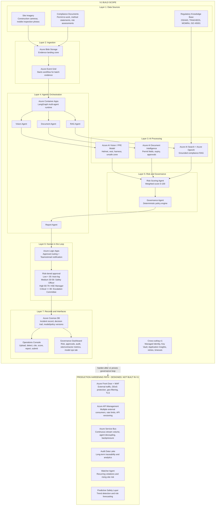
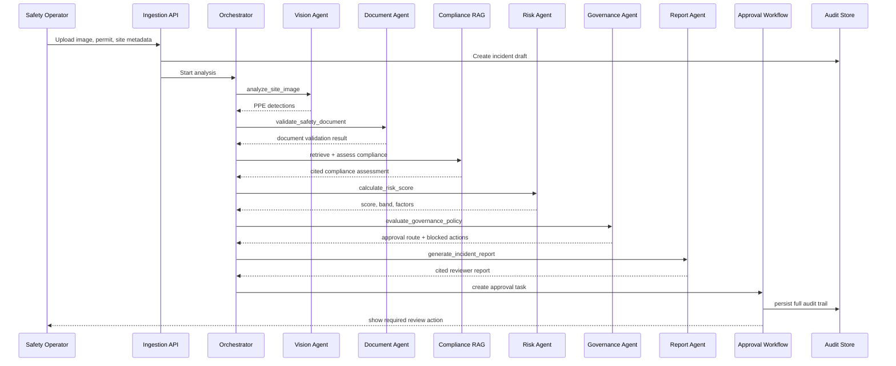

# SafeWatch AI v1 Architecture

## 1. Architecture Goal

SafeWatch AI v1 is an enterprise safety governance platform for construction and industrial environments.

The build should prove the full safety decision loop:

1. Inspect site evidence.
2. Detect PPE or permit/document issues.
3. Retrieve applicable safety regulations.
4. Score operational risk.
5. Apply deterministic governance rules.
6. Generate a cited safety report.
7. Route the case through human approval.
8. Persist a complete audit record.
9. Present operational and governance views through two enterprise UIs.

The v1 scope stays intentionally lean: static image PPE detection, compliance RAG, document validation, risk scoring, deterministic governance, human-in-the-loop workflow, and two dashboards.

## 2. Product Scope

### v1 Build Scope

- Computer Vision PPE detection on static images.
- Compliance RAG over OSHAD, TRAKHEES, MOMRA, and ISO 45001 content.
- Document validation for permits and safety documents.
- Risk Scoring Agent using weighted business logic.
- Governance Agent using deterministic policy rules.
- Report Agent for cited incident summaries and reviewer packets.
- Human-in-the-loop approval workflow.
- Operations Console for safety operators.
- Governance Dashboard for HSE managers and compliance reviewers.

### Deferred Roadmap

- Watcher Agent and trend analysis.
- Predictive safety forecasting.
- Contractor safety scoring using historical behavior.
- Multi-site and multi-tenant governance.
- Executive safety command center.

## 3. High-Level System View



## 4. Azure Reference Architecture

| Layer | Azure Service | Responsibility |
| --- | --- | --- |
| Frontend | Azure Static Web Apps or App Service | Host Operations Console and Governance Dashboard. |
| API | Azure App Service / Container Apps | Expose ingestion, incident, approval, and dashboard APIs. |
| Orchestration | Azure Container Apps / Azure Functions | Coordinate agent calls and workflow transitions. |
| Vision | Azure AI Vision or custom model endpoint | Detect PPE violations from uploaded static images. |
| RAG | Azure AI Search + Azure OpenAI | Retrieve OSHAD / TRAKHEES / MOMRA / ISO 45001 clauses and generate grounded compliance reasoning. |
| Documents | Azure AI Document Intelligence or custom validators | Extract and validate permit/document fields. |
| Storage | Azure Blob Storage | Store images, permits, generated reports, and evidence artifacts. |
| Database | Azure Cosmos DB | Store incidents, decisions, audit records, policies, risk scores, and workflow state. |
| Eventing | Azure Event Grid | Trigger the v1 AI workflow when new batch evidence lands in Blob Storage. |
| Identity | Microsoft Entra ID | Role-based access for Safety Officer, HSE Manager, Compliance Reviewer, Admin. |
| Monitoring | Application Insights | Trace API calls, agent execution, latency, failures, and workflow events. |
| Secrets | Azure Key Vault | Store API keys, model endpoints, and policy configuration secrets. |

Production hardening services such as Azure Front Door, WAF, Azure API Management, and Azure Service Bus are part of the designed roadmap, not the v1 build. They become necessary when the platform serves external traffic, multiple external API consumers, or continuous stream volume.

## 5. Core Agent Design

### 5.1 Vision Agent

Purpose: detect PPE status from site images.

Inputs:

- Image URI.
- Site ID.
- Work zone type.
- Optional job/task metadata.

Outputs:

- Detected workers.
- PPE present or missing.
- Violation labels.
- Confidence scores.
- Annotated image reference, if available.

Example:

```json
{
  "workers_detected": 3,
  "violations": [
    {
      "type": "missing_harness",
      "worker_ref": "worker_2",
      "confidence": 0.91
    }
  ]
}
```

### 5.2 Document Validation Agent

Purpose: validate permits and safety documents attached to an incident.

Inputs:

- Permit/document URI.
- Site ID.
- Work type.
- Incident timestamp.

Outputs:

- Document type.
- Extracted fields.
- Missing fields.
- Expired documents.
- Validation result.

Example validations:

- Permit-to-work exists.
- Permit has not expired.
- Work type matches incident context.
- Mandatory fields are present.
- Approver signature exists.

### 5.3 Compliance RAG Agent

Purpose: retrieve relevant OSHAD / TRAKHEES / MOMRA / ISO 45001 clauses and produce grounded compliance context.

Inputs:

- Detected violation.
- Work zone.
- Task type.
- Document validation result.

Outputs:

- Relevant clauses.
- Citation references.
- Compliance interpretation.
- Recommended corrective action.

Retrieval rules:

- Always cite retrieved source chunks.
- Return "insufficient evidence" when no relevant regulation is found.
- Separate retrieved regulation from generated interpretation.
- Store retrieved clause IDs in the audit trail.

### 5.4 Report Agent

Purpose: generate the structured incident report that a human reviewer can act on.

Inputs:

- Vision result.
- Document validation result.
- Retrieved compliance clauses.
- Compliance assessment.
- Risk score.
- Governance decision.

Outputs:

- Incident summary.
- Detected violation.
- Applicable citations.
- Risk explanation.
- Required approval route.
- Recommended corrective actions.

The Report Agent may use an LLM for summarization, but it cannot make approval, closure, or escalation decisions.

### 5.5 Risk Scoring Agent

Purpose: calculate a composite risk score using deterministic weighted logic.

Inputs:

- PPE violation severity.
- Work zone classification.
- Number of workers involved.
- Permit status.
- Regulatory severity.
- Historical contractor/site context, if available in v1.

Initial scoring model:

| Factor | Weight |
| --- | ---: |
| PPE severity | 30 |
| Work zone risk | 20 |
| Permit/document status | 20 |
| Regulatory severity | 15 |
| Number of workers exposed | 10 |
| Recent related incidents | 5 |

Risk bands:

| Score | Band | Meaning |
| ---: | --- | --- |
| 0-29 | Low | Auto-log. |
| 30-59 | Medium | Safety Officer review. |
| 60-79 | High | HSE Manager approval. |
| 80-100 | Critical | Escalation Committee review. |

### 5.6 Governance Agent

Purpose: apply deterministic policy rules before final action.

Inputs:

- Risk score and band.
- Compliance result.
- Document validation result.
- Contractor/site context.
- Current policy version.

Outputs:

- Required approval level.
- Allowed actions.
- Blocked actions.
- Escalation reason.
- Policy rules triggered.

Example rules:

```text
IF risk_score < 30 THEN approval_level = "Auto Log"
IF risk_score >= 30 AND risk_score < 60 THEN approval_level = "Safety Officer"
IF risk_score >= 60 AND risk_score < 80 THEN approval_level = "HSE Manager"
IF risk_score >= 80 THEN approval_level = "Escalation Committee"
IF permit_status = "expired" THEN block_closure = true
IF violation_type = "missing_harness" AND work_zone = "elevated_work" THEN minimum_risk_band = "High"
IF compliance_citation_missing = true THEN require_manual_compliance_review = true
```

## 6. MCP Tool Boundary

MCP should expose narrow, auditable tools rather than one large "do everything" agent.

Recommended tools:

| Tool | Owner | Purpose |
| --- | --- | --- |
| `analyze_site_image` | Vision Agent | Detect PPE violations in image evidence. |
| `validate_safety_document` | Document Validation Agent | Extract and validate permit/document fields. |
| `retrieve_compliance_clauses` | Compliance RAG Agent | Search OSHAD / TRAKHEES / MOMRA / ISO 45001 knowledge base. |
| `generate_compliance_assessment` | Compliance RAG Agent | Produce cited compliance interpretation. |
| `calculate_risk_score` | Risk Scoring Agent | Produce score, band, and factor explanation. |
| `evaluate_governance_policy` | Governance Agent | Apply deterministic approval/escalation rules. |
| `generate_incident_report` | Report Agent | Produce the cited reviewer packet. |
| `create_incident_record` | Workflow Service | Persist incident and audit details. |
| `submit_human_decision` | Workflow Service | Record approval, rejection, override, or escalation. |
| `get_dashboard_metrics` | Reporting Service | Return operations/governance metrics. |

Tool design principles:

- Every tool call receives a correlation ID.
- Every tool output is persisted to the audit store.
- Policy and model versions are included in outputs.
- LLM-generated text is separated from deterministic decisions.
- Closure decisions always require governance validation.

## 7. End-to-End Workflow



## 8. Data Model

### Incident

| Field | Description |
| --- | --- |
| `incident_id` | Unique incident identifier. |
| `site_id` | Site where evidence was captured. |
| `zone_id` | Work zone or location. |
| `work_type` | Work activity classification. |
| `contractor_id` | Contractor or team involved. |
| `status` | Draft, analyzed, pending_review, approved, rejected, escalated, closed. |
| `created_at` | Incident creation timestamp. |
| `created_by` | User or system actor. |

### Evidence

| Field | Description |
| --- | --- |
| `evidence_id` | Evidence identifier. |
| `incident_id` | Parent incident. |
| `type` | image, permit, document, report. |
| `blob_uri` | Storage reference. |
| `hash` | File hash for audit integrity. |
| `uploaded_at` | Upload timestamp. |

### Agent Result

| Field | Description |
| --- | --- |
| `agent_result_id` | Result identifier. |
| `incident_id` | Parent incident. |
| `agent_name` | Vision, Document, RAG, Risk, Governance. |
| `input_ref` | Evidence/result references used. |
| `output_json` | Structured output. |
| `model_version` | Model version, if applicable. |
| `prompt_version` | Prompt version, if applicable. |
| `policy_version` | Policy version, if applicable. |
| `created_at` | Execution timestamp. |

### Approval Task

| Field | Description |
| --- | --- |
| `approval_task_id` | Approval task identifier. |
| `incident_id` | Parent incident. |
| `required_role` | Safety Officer, HSE Manager, Escalation Committee. |
| `assigned_to` | Reviewer. |
| `decision` | approve, reject, override, escalate. |
| `decision_reason` | Human explanation. |
| `decided_at` | Decision timestamp. |

### Audit Event

| Field | Description |
| --- | --- |
| `audit_event_id` | Audit identifier. |
| `incident_id` | Parent incident. |
| `event_type` | created, analyzed, policy_applied, reviewed, closed. |
| `actor_type` | user, system, agent. |
| `actor_id` | Actor identifier. |
| `payload_json` | Event details. |
| `created_at` | Event timestamp. |

## 9. UI Architecture

### 9.1 Operations Console

Primary users:

- Safety officers.
- Site supervisors.
- HSE operators.

Core screens:

- Incident intake.
- Evidence upload.
- PPE detection result.
- Compliance assessment.
- Risk score explanation.
- Human review queue.
- Incident closure decision.

Key UX requirement:

The operator should see what was detected, why it matters, which regulation applies, and what action is required.

### 9.2 Governance Dashboard

Primary users:

- HSE managers.
- Compliance leads.
- Audit reviewers.
- Project leadership.

Core screens:

- Risk distribution by band.
- Pending approvals by role.
- Escalated incidents.
- Human override rate.
- Policy-trigger summary.
- Compliance citation coverage.
- Audit trail detail view.
- Model and policy operations tab.

Key UX requirement:

The governance user should understand whether the AI process is controlled, auditable, and aligned with safety policy.

## 10. Security and Governance

Minimum v1 controls:

- Entra ID authentication.
- Role-based access control.
- Audit logging for all agent and human decisions.
- Immutable file references using blob hash.
- Policy versioning.
- Prompt versioning for RAG assessment prompts.
- Model version tracking for vision and LLM calls.
- Manual override reason required.
- Incident closure blocked when mandatory governance rules fail.
- Managed Identity for Azure resource access; no secrets in code.

## 11. Observability

Track:

- End-to-end incident analysis latency.
- Agent execution latency.
- Agent failure rate.
- RAG retrieval coverage.
- Citation missing rate.
- Vision confidence distribution.
- Human review turnaround time.
- Override rate.
- Escalation rate.

Every workflow should carry:

- `correlation_id`
- `incident_id`
- `agent_run_id`
- `user_id`, when user initiated
- timeout and retry outcome

## 12. v1 Milestones

### Milestone 1: Architecture and Skeleton

- Finalize agent/tool contracts.
- Create database schema.
- Create API skeleton.
- Create basic two-UI shell.

### Milestone 2: AI Workflow

- Implement image upload.
- Integrate PPE detection.
- Implement RAG retrieval.
- Implement document validation stub or first validator.

### Milestone 3: Governance Workflow

- Implement risk scoring.
- Implement governance policy engine.
- Implement approval task lifecycle.
- Persist full audit trail.

### Milestone 4: Enterprise Demo

- Complete Operations Console.
- Complete Governance Dashboard.
- Add sample incidents.
- Prepare demo script and architecture narrative.

## 13. Suggested Repository Structure

```text
safewatch-ai/
  apps/
    operations-console/
    governance-dashboard/
    api/
  services/
    orchestrator/
    vision-agent/
    document-agent/
    compliance-rag-agent/
    report-agent/
    risk-scoring-agent/
    governance-agent/
    workflow-service/
  packages/
    contracts/
    policy-engine/
    audit/
    shared-types/
  infra/
    azure/
    bicep/
  docs/
    safewatch-ai-v1-architecture.md
    api-contracts.md
    data-model.md
    demo-script.md
```

## 14. Build Decision Summary

Recommended v1 architecture:

- Use a shared orchestrator that calls explicit MCP-style tools.
- Keep risk scoring and governance deterministic.
- Use RAG only for compliance retrieval and explanation.
- Store every agent output and human decision in an audit trail.
- Build two UIs only: Operations Console and Governance Dashboard.
- Fold model/policy operations into the Governance Dashboard instead of building a third UI.
- Present Phase 2+ as roadmap, not current implementation.
